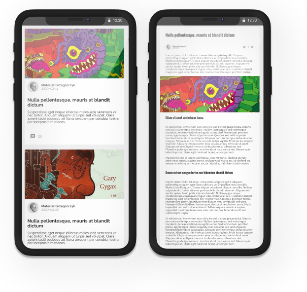

# CMS blog

### Blog website and application for managing content written in vanilla Javascript



## General info

This frontend application works together with this
[rails application](https://github.com/matigrzegor/cms-blog)

This is a blog website and blog content management application. You can create, edit, and delete
posts. In the administration panel, you can generate tokens needed to register new authors. The
application allows you to manage your profile.

## Tech info

- The CMS blog was written in **vanilla Javascript**. I used **Webpack** and split the code into
  modules.
- Authentication and authorization have been implemented based on the **OAuth 2.0** protocol using
  the **Authorization Code Grant** flow.
- An **access token** is stored in a variable and when refreshing the page or when the access token
  expires, **refresh token** allows an application to obtain a new access token.
- I used the WYSIWYG **Quill** editor and **Delta** format for API communication.
- The drop-down menu is written in **Web Component** technology.
- In a project, I wanted to learn asynchronous JavaScript and write reusable components.

## Technologies

- Javascript
- Webpack
- Quill editor
- OAuth 2.0
- Web Components
- SASS

## Setup

To run this project, install it locally using npm:

```sh
$ npm install
$ npm start
```

## Link to app

Go to this [link](https://musing-ramanujan-8002a4.netlify.app/redirect) and click the **Authorize**
button.

To test app login using **admin@admin.com** email and password: **adminadmin**.

If you want to create a new author, you need to log in as administrator (as above) and generate a
registration token. Then click on this [link](https://musing-ramanujan-8002a4.netlify.app/auth) and
fill out the form.

To see the blog as a visitor just go to [blog website](https://musing-ramanujan-8002a4.netlify.app)

## Link to Rails Application

[rails application](https://github.com/matigrzegor/cms-blog)
